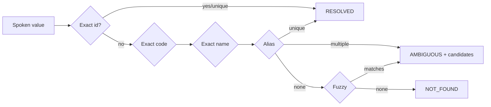
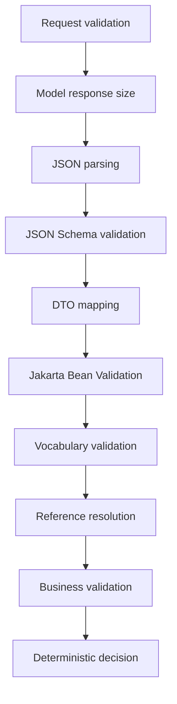
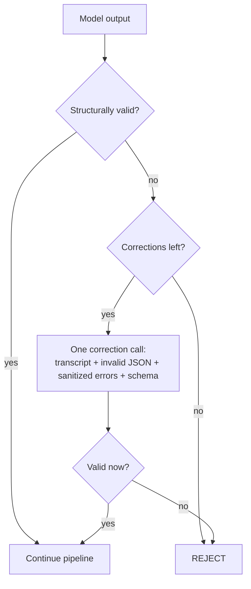
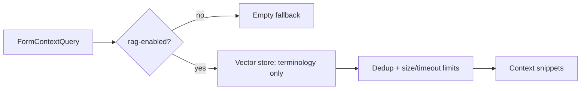

# Wildlife Form Extractor

Converts wildlife field-observation **speech-to-text transcripts** into **validated, structured JSON**
for filling six different wildlife observation forms. The model proposes field values; deterministic
Java code validates them, resolves references, decides acceptance, and only stores a result after an
explicit confirmation step. The LLM never decides anything binding and never touches identifiers,
references, tools, URLs, or persistence.

- **1. Purpose** — turn noisy spoken observations into safe, reviewable structured data.
- **2. Technology** — Java 17, Spring Boot 4.1.0, Spring AI 2.0.0 (Ollama), Maven, Spring Web MVC,
  Jackson, Jakarta Bean Validation, JSON Schema Draft 2020-12 (networknt), Actuator + Micrometer,
  Resilience4j, Docker Compose. Tests: JUnit 5, Mockito, MockMvc, OkHttp MockWebServer.

> Build/runtime note: the project targets Java 17 bytecode but runs on any JDK ≥ 17. Spring Boot 4.1
> uses Jackson 3 for the web layer; the extraction pipeline uses a dedicated Jackson 2 `ObjectMapper`
> because the JSON Schema validator (networknt 1.5.x) is Jackson-2 based.

## 3. Architecture

```mermaid
flowchart TD
    C[Client] -->|POST /api/v1/wildlife-extractions| API[WildlifeExtractionController]
    API --> SVC[WildlifeExtractionService]
    SVC --> REG[FormDefinitionRegistry]
    SVC --> RES[ResilientWildlifeExtractionModel]
    RES --> ADP[SpringAiOllamaStructuredWildlifeExtractionModel]
    ADP -->|Spring AI ChatModel| OLL[(Ollama)]
    SVC --> PIPE[ExtractionValidationPipeline]
    PIPE --> SCHEMA[Schema validator]
    PIPE --> VOCAB[Vocabulary validator]
    PIPE --> REFS[Reference resolvers]
    PIPE --> BUS[Business validator]
    PIPE --> DEC[ExtractionDecisionService]
    SVC --> REPO[(In-memory repository)]
    API -->|POST /{requestId}/confirm| SVC
```

Package layout follows dependency inversion: `domain` and `application` never depend on Ollama,
Spring AI, the schema library, persistence, or HTTP transport — those live in `infrastructure`.

```
com.acn.wildlifeextractor
├── api            controllers, request/response DTOs, ProblemDetail advice
├── application    extraction orchestration, validation, decision, references, vocabulary, rag, confirmation
├── domain         form types, field records, extraction/reference/vocabulary/validation model
├── infrastructure springai/ollama, schema, reference, persistence, resilience, observability, form, rag
└── configuration  typed @ConfigurationProperties, Jackson pipeline mapper
```

## 4. Supported form types

`SIGHTING`, `FEEDING_OBSERVATION`, `NEST_SITE_CHARACTERISTICS`, `NEST_EGGS_CHICK`,
`COMPETITORS_AND_PREDATORS`, `RINGING_MORPHS`.

## 5. Form fields

Each form has a typed DTO of `Extracted*` field records (see `domain/extraction`). Schemas listing
every field live in `src/main/resources/ai/schemas/<schema-version>.schema.json`:
`sighting-v1`, `feeding-observation-v1`, `nest-site-characteristics-v1`,
`competitors-and-predators-v1`, `nest-eggs-chick-v1`, `ringing-morphs-v1`. Legacy fields exist as
disabled nested `legacy` sections and are rejected by the default schemas.

## 6. Field status meanings

`PRESENT` (value stated, evidence required) · `MISSING` (not stated; null value, null evidence) ·
`AMBIGUOUS` (unclear/conflicting) · `INVALID` (stated but not normalizable) · `NOT_APPLICABLE` ·
`UNRESOLVED_REFERENCE` (spoken reference could not be resolved).

## 7. Vocabulary strategy

Vocabularies (`src/main/resources/vocabularies/*.yml`) are `OPEN` or `CLOSED`.

- `CLOSED`: only listed values or deterministic aliases are accepted; anything else is an invalid field.
- `OPEN` with a non-empty approved list: unlisted values produce a warning (and, in strict mode, a
  manual-review reason).
- `OPEN` with an empty list is treated as not-yet-constrained and accepted silently.
- Aliases map deterministically to exactly one canonical value (duplicate/ambiguous alias mappings
  fail loading). The model can never add vocabulary values.

## 8. Reference resolution



Resolvers are per type (`SPECIES`, `TREE_SPECIES`, `COMPETITOR_SPECIES`, `BIRD_OR_RINGING_RECORD`,
`NEST_SITE`, `USER`), backed by YAML in `src/main/resources/reference/`. A result is never
auto-selected when several plausible matches remain. Only deterministic code sets
`resolvedExternalId`, `resolvedDisplayName`, `resolutionStatus`, and `candidates`.

## 9. Spring AI integration & 10. Ollama setup

The Ollama adapter (`infrastructure/springai/ollama`) uses Spring AI 2.0 `ChatModel`. Temperature is
zero, model thinking is disabled, no tools/streaming/memory are used, and separate system and user
messages are built (the transcript is only ever in the user message, wrapped in `<transcript>`
delimiters).

```bash
docker compose up -d ollama
docker compose exec ollama ollama pull llama3.1:8b
```

## 11. Structured-output strategy & 12. JSON Schema validation

The form's JSON Schema is sent to Ollama as the native `format` option for structured output. The raw
text is still received untrusted, size-checked, parsed independently into a Jackson `JsonNode`, and
validated against the checked-in Draft 2020-12 schema (`additionalProperties: false`, coordinate and
count/measurement ranges, ISO date/time patterns, evidence-required-when-PRESENT, null-value rules,
bounded lists). Schema errors are sanitized (no instance values).

## 13. Validation pipeline



## 14. Correction flow



Correction is attempted **only** for structurally repairable failures (malformed JSON, schema, DTO/bean
validation) — never for missing facts, unknown species/vocabulary, ambiguity, business contradictions,
timeouts, or capacity. `modelCallCount`, `correctionAttemptCount`, and `infrastructureRetryCount` are
tracked separately.

## 15. Decision rules

- **ACCEPT_AUTOMATICALLY** — all required values valid, no ambiguity/contradiction, all required
  references resolved.
- **REQUEST_MORE_INFORMATION** — required information absent.
- **MANUAL_REVIEW** — ambiguity, contradiction, invalid field, unresolved required reference, or an
  open-vocabulary warning requiring review.
- **REJECT** — malformed/unsafe/structurally invalid output after correction is exhausted.

## 16. REST API examples

Successful **Sighting**:

```bash
curl -s -X POST http://localhost:8080/api/v1/wildlife-extractions \
  -H 'Content-Type: application/json' \
  -d '{"requestId":"req-1","conversationId":"conv-1","formType":"SIGHTING",
       "transcript":"At ten thirty I saw an Echo Parakeet near the feeder.",
       "transcriptTimestamp":"2026-07-30T10:30:00+04:00","language":"en"}'
```

**Feeding Observation**:

```bash
curl -s -X POST http://localhost:8080/api/v1/wildlife-extractions \
  -H 'Content-Type: application/json' \
  -d '{"requestId":"req-2","conversationId":"conv-1","formType":"FEEDING_OBSERVATION",
       "transcript":"On the 30th of July the Echo Parakeet was feeding in a FICUS tree.",
       "transcriptTimestamp":"2026-07-30T10:30:00+04:00","language":"en"}'
```

**Nest with egg and chick**:

```bash
curl -s -X POST http://localhost:8080/api/v1/wildlife-extractions \
  -H 'Content-Type: application/json' \
  -d '{"requestId":"req-3","conversationId":"conv-1","formType":"NEST_EGGS_CHICK",
       "transcript":"At nest NEST-100, Echo Parakeet, two eggs and one chick that hatched on the fifth of May.",
       "transcriptTimestamp":"2026-07-30T10:30:00+04:00","language":"en"}'
```

**Missing-information** (empty transcript → `400`) and **manual-review** (e.g. contradictory presence
values → `decision: MANUAL_REVIEW`) behave as described in section 15.

## 17. Confirmation flow

```bash
curl -s -X POST http://localhost:8080/api/v1/wildlife-extractions/req-1/confirm
```

Confirmation finds the stored extraction, rejects unknown ids (`404`), is idempotent for already
confirmed requests, refuses `REJECT` results and unresolved required references, re-checks the schema
version, and stores the confirmed record.

## 18. Idempotency

`requestId` is the idempotency key. A fingerprint is computed from `conversationId + formType +
schemaVersion + SHA-256(normalized transcript)` (the transcript itself is never stored). Same id + same
fingerprint returns the existing result without calling the model again; same id + different fingerprint
returns `409 Conflict`. Concurrent duplicates run the model at most once.

## 19. Reliability

Circuit breaker (trips on transport failures only), bulkhead (bounded concurrent calls with a bounded
wait), an admission bound on pending calls (excess → `503 EXTRACTION_CAPACITY_EXCEEDED`), a per-call
execution timeout, and retries limited to safe transient failures. Validation/schema/business failures
and provider 4xx are never retried. The model executor shuts down gracefully with the context.

## 20. Security

No transcript/prompt/response/coordinate/identifier logging; sanitized schema errors; correlation ids
via `X-Correlation-Id`; max HTTP body, transcript, and model-response sizes; no tool calling, URL
fetching, or command execution from transcripts; no persistence of invalid output; no secrets in source.
Prompt-injection text inside transcripts is treated as ordinary observation data.

## 21. Observability

Micrometer metrics (`wildlife.extraction.*`: requests, decisions, model calls/latency, correction
attempts, total latency, failures) use only low-cardinality tags (formType, decision, provider, model,
failureCategory). Actuator exposes `health`, `info`, `metrics`, `prometheus`, and liveness/readiness
probes. An `ollama` health indicator reports model-server reachability without affecting readiness.

## 22. Optional RAG

Disabled by default (`application.extraction.rag-enabled=false`); a no-op `FormContextRetriever` is
used. Any future vector-store implementation may only supply terminology/definitions and must never
introduce observation facts absent from the transcript.

## 23. Testing & 24. Evaluation metrics



Unit and slice tests cover configuration, DTOs, schemas, vocabularies, the Spring AI adapter boundary,
business rules, references, controllers (MockMvc), correction, resilience, and security logging. Run:

```bash
./mvnw clean test
```

Labelled evaluation fixtures live in `src/test/resources/evaluation/fixtures.json` (all six forms plus
prompt-injection, empty, contradictory, nested, invalid-coordinate, multiple-reference cases).
Computing accuracy/latency metrics against them requires a running Ollama server (see the integration
profile); a response counts as successful only when its extracted values are correct, not merely valid
JSON.

## 25. Docker setup

```bash
docker compose up -d ollama
docker compose exec ollama ollama pull llama3.1:8b
docker compose up --build app
```

## 26. Adding a form

1. Add the value to `WildlifeFormType`. 2. Create the `*ExtractionFields` DTO. 3. Add the schema under
`ai/schemas/` and prompt under `ai/prompts/`. 4. Add a `*FormDefinition` `@Component`. Startup fails on
duplicate form type/schema version, missing/invalid schema, or missing prompt.

## 27. Adding vocabulary values

Edit the vocabulary YAML in `src/main/resources/vocabularies/`: add allowed values and/or aliases.

## 28. Changing an open vocabulary to closed

Set `validationMode: CLOSED` and populate `allowedValues` (and aliases). Closed values are then
enforced as invalid-field failures.

## 29. Adding an LLM provider

Implement `StructuredWildlifeExtractionModel` in a new `infrastructure/springai/<provider>` package,
keeping provider types confined there, and register it in place of (or ahead of, via `@Primary`) the
Ollama adapter behind the resilience decorator.

## 30. Known limitations

- Required-field policy is intentionally minimal (`species` per form) and meant to be extended.
- Native structured-output support for `$ref`/`$defs` schemas depends on the chosen Ollama model.
- Reference and idempotency stores are in-memory (not clustered/persistent).
- Fuzzy reference matching is conservative (returns candidates, never auto-selects).
- The optional RAG vector store is a designed extension point, not a shipped implementation.

## Commands

```bash
./mvnw clean test        # unit/slice tests (no Ollama required)
./mvnw clean verify      # full verification
./mvnw spring-boot:run   # run locally (expects Ollama at OLLAMA_BASE_URL)
OLLAMA_IT=true ./mvnw test -Dtest=OllamaIntegrationTest   # end-to-end against a real Ollama
```
